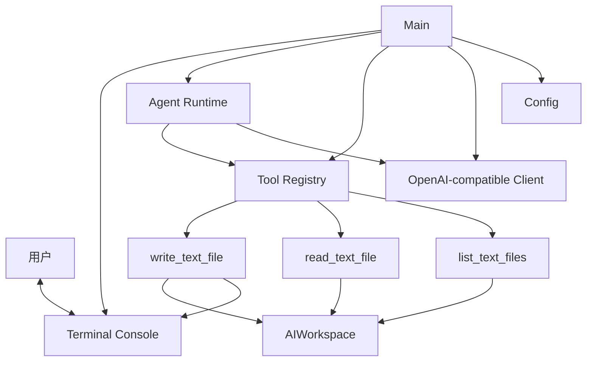

# Agent Lab

Agent Lab 是一个使用 Go 实现的命令行 Agent 实验项目。

项目不依赖现成的 Agent 框架，主要用于学习并实现以下核心机制：

- 与 OpenAI Chat Completions 兼容的模型客户端；
- 模型无关的消息与工具协议；
- 工具注册和名称查找；
- 多步工具调用循环；
- 对话历史的事务式提交；
- 受控工作区中的文件读写；
- 副作用操作的用户确认。

## 当前能力

Agent 可以在受控工作区 `./AIWorkspace` 中执行以下操作：

| 工具 | 作用 | 是否需要确认 |
|---|---|---|
| `list_text_files` | 列出可读取的 `.txt` 文件 | 否 |
| `read_text_file` | 读取指定文本文件 | 否 |
| `write_text_file` | 创建或覆盖文本文件 | 是 |

写入操作只有在用户通过终端明确输入 `y` 后才会执行。模型本身不能代替用户完成授权。

## 运行要求

- Go 版本以 `go.mod` 为准；
- 一个兼容 OpenAI Chat Completions 协议的模型服务；
- 有效的模型 API Key。

程序当前应从仓库根目录运行，因为配置文件和工作区使用仓库根目录的相对路径。

## 配置

复制环境变量示例：

```bash
cp agent_lab/.env.example agent_lab/.env.local
```

编辑 `agent_lab/.env.local`：

```env
AI_API_KEY=your-api-key
MODEL=your-model-name
LLM_API_URL=https://example.com/chat/completions
REQUEST_TIMEOUT=60s
SYSTEM_PROMPT=You are a professional AI assistant.
```

环境变量说明：

| 变量 | 必需 | 说明 |
|---|---|---|
| `AI_API_KEY` | 是 | 模型服务的 API Key |
| `MODEL` | 否 | 模型名称 |
| `LLM_API_URL` | 否 | Chat Completions 接口地址 |
| `REQUEST_TIMEOUT` | 否 | 单次请求超时时间，例如 `60s` |
| `SYSTEM_PROMPT` | 否 | Agent 的系统提示词 |

除 `AI_API_KEY` 外，其他配置存在程序默认值。

## 运行

在仓库根目录执行：

```bash
go run ./agent_lab/cmd/agent-lab
```

输入：

```text
exit
```

退出程序。

示例任务：

```text
列出工作区中的文本文件。
```

```text
读取 zero.txt。
```

```text
创建 note.txt，内容为今天需要完成 Agent Lab 的测试。
```

写入任务会显示操作摘要和完整内容，并要求用户输入 `y` 或 `n`。

## 测试

运行全部测试：

```bash
go test ./...
```

测试覆盖的主要边界包括：

- 配置加载；
- OpenAI 协议转换；
- 模型工具调用解析；
- 工具注册和查找；
- Agent 多步工具循环；
- 工具循环失败时的历史回滚；
- 文件名与内容校验；
- 文件大小限制；
- 符号链接读写防护；
- 用户允许、拒绝和无效确认输入。

## 架构



### 主要职责

- `model`：定义与模型供应商无关的消息、请求、响应和工具协议；
- `model/openai`：负责 OpenAI 兼容协议和内部模型之间的转换；
- `tool`：定义工具接口、确认接口和工具注册表；
- `agent`：管理对话历史和多步工具调用循环；
- `workspace`：实现受控文件操作及对应模型工具；
- `terminal`：统一终端输入输出，并从用户处取得副作用授权；
- `config`：加载环境变量和程序配置。

## 工具调用流程

```text
用户输入
→ Runtime 请求模型
→ 模型返回工具调用
→ Registry 查找工具
→ Runtime 执行工具
→ 工具结果作为 tool 消息返回模型
→ 模型继续调用工具或生成最终回答
→ 成功后提交本轮完整历史
```

如果模型请求失败、响应非法或超过最大执行步数，本轮候选历史不会写入正式对话历史。

## 安全边界

当前文件工具具有以下限制：

- 只能访问 `./AIWorkspace`；
- 只接受简单的 `.txt` 文件名；
- 不允许路径分隔符和上级目录引用；
- 拒绝读取或覆盖符号链接；
- 拒绝读取或覆盖非普通文件；
- 限制单次读取大小；
- 限制写入内容的字符数和字节数；
- 所有写入操作必须经过用户明确确认；
- 模型不能自行产生确认结果。

本项目是学习和实验项目，不应直接作为生产环境中的文件操作服务使用。

## 当前限制

- 对话历史只保存在内存中；
- 没有流式响应；
- 没有自动裁剪长对话历史；
- 文件工具只支持工作区根目录下的 `.txt` 文件；
- 写入采用完整覆盖，不支持追加和局部修改；
- 没有并行执行工具；
- 没有持久化的调用日志和评估数据；
- 终端读取不能在阻塞期间立即响应 Context 取消。

## 项目结构

```text
agent_lab/
├── cmd/agent-lab/       程序入口和依赖装配
└── internal/
    ├── agent/           Agent运行时和工具循环
    ├── config/          配置加载
    ├── model/           内部模型协议
    │   └── openai/      OpenAI兼容适配
    ├── terminal/        终端输入输出和用户确认
    ├── tool/            工具接口与注册表
    └── workspace/       受控文件能力与文件工具
```

## 设计目标

Agent Lab 的目标是理解 Agent 的核心执行机制，而不是提供一个完整的通用 Agent 框架。

第一版重点保证：

- 职责边界清晰；
- 模型协议与业务工具解耦；
- 工具可以独立测试和替换；
- 副作用操作不能绕过用户授权；
- 工具循环失败时不会污染正式历史。

留言: 学习网关项目,该项目2个月内不会继续维护更新,之后可能尝试网关项目与该项目做合并
